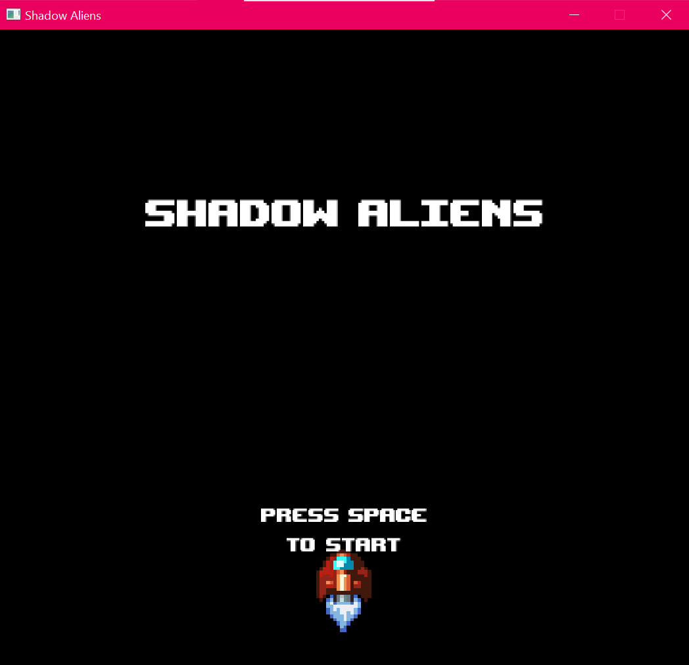
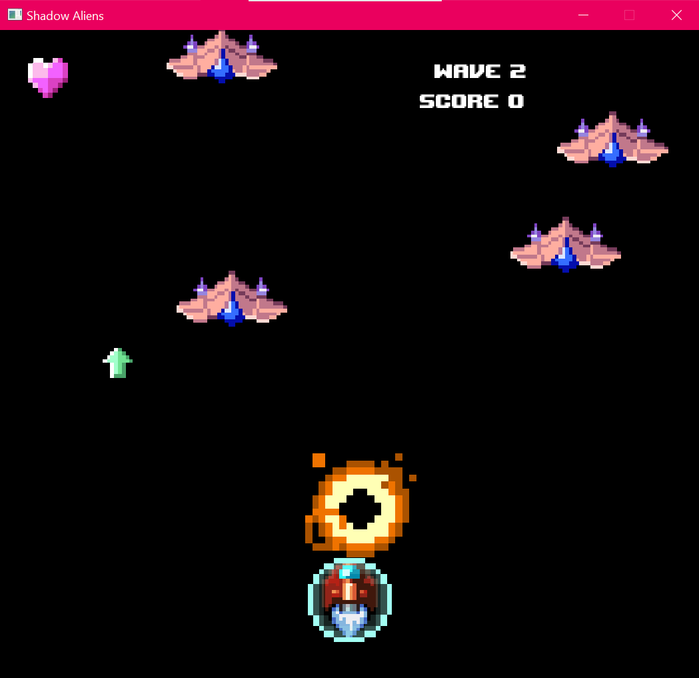
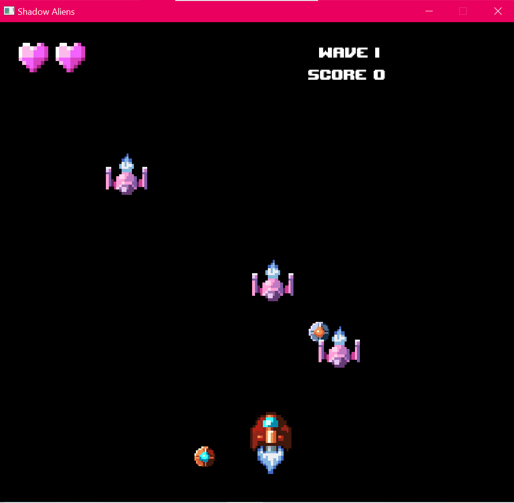
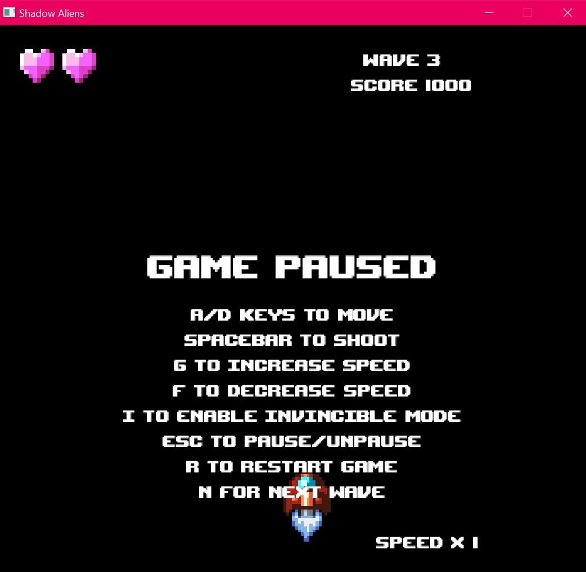
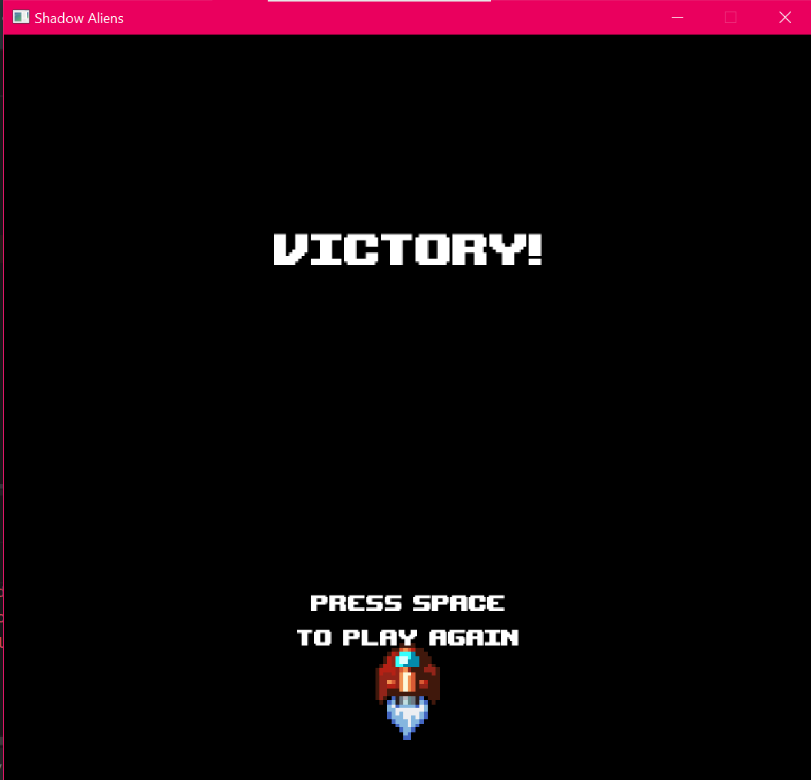

# SWEN20003 Semester 1, 2026
# Shadow Aliens

## Running the Project

Requirements

- Java 25
- IntelliJ IDEA

Clone the repository:

```bash
git clone https://github.com/tasnimhumayra447/Shadow-Aliens-2D-Space-Shooter.git
```

Open the project in IntelliJ and run the main application.

## Demo

* https://youtu.be/sFo7vu8Grx4

## Features

- Real-time player movement and cooldown-based shooting
- Three enemy types:
    - Regular
    - Strafing
    - Shooting
- Progressive wave system with increasing difficulty
- Four power-ups:
    - Shield
    - Life
    - Cooldown
    - Engine
- Collision detection and explosion effects
- Score and life tracking
- Multiple game states:
    - Start
    - Battle
    - Pause
    - End
- Developer mode:
    - Increase/decrease game speed
    - Toggle invincibility
    - Skip to next wave
    - Restart game
- External configuration using `gameData.properties`

## Technologies

- Java
- Object-Oriented Programming
- IntelliJ IDEA
- Bagel Game Engine

## Object-Oriented Design

The project applies several OOP principles:

- Inheritance for different enemy and power-up types
- Polymorphism through shared entity behaviour
- Encapsulation of game state and entity logic
- Delegation of responsibilities across game components
- Modular architecture for maintainability and extensibility

## Controls

### Gameplay

| Key   | Action |
|-------|--------|
| A / D | Move   |
| Space | Shoot  |
| Esc   | Pause  |

### Developer Mode

| Key  | Action               |
|------|----------------------|
| G    | Increase game speed  |
| F    | Decrease game speed  |
| I    | Toggle invincibility |
| N    | Skip to next wave    |
| R    | Restart game         |

## Configuration

Game settings are loaded dynamically from `gameData.properties`.

This file controls:

- Window size
- Enemy spawning times
- Wave configuration
- Player attributes
- Power-ups
- UI text
- Images
- Scoring
- Timing values

## Screenshots

- Start screen

- Battle screen (Gameplay)


- Pause screen

- End screen

